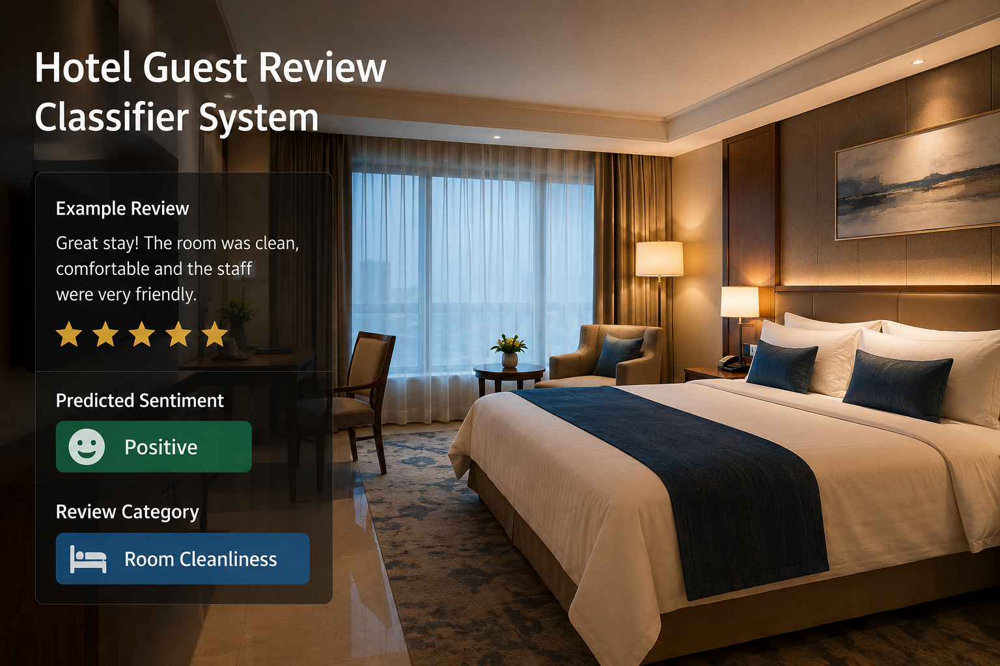

# INN Sight AI — Hotel & Homestay Review Intelligence Platform

> **An intelligent AI-powered guest review classifier and sentiment intelligence platform built for modern hospitality managers to analyze feedback, detect themes, summarize reviews, and generate automated management responses in real-time.**

[](https://stay-inn-sight-ai-f3ov.vercel.app)
[](https://stay-inn-sight-ai.onrender.com)
[](https://github.com/mehaksethiii/Stay-INN_sight-AI)
[](https://opensource.org/licenses/MIT)

---

## 🌐 1. Live Deployment & Links
- **Frontend Live URL**: [https://stay-inn-sight-ai-f3ov.vercel.app](https://stay-inn-sight-ai-f3ov.vercel.app)
- **Backend API URL**: [https://stay-inn-sight-ai.onrender.com](https://stay-inn-sight-ai.onrender.com)
- **Database**: MongoDB Atlas Cloud Cluster

---

## 📸 2. Application Screenshots & Visual Showcase

<p align="center">
  
</p>

<p align="center">
  <b>🌟 Landing Page & Hero Review Intelligence Showcase</b>
</p>

<br />

| 🏨 AI Review Analyser & Summarizer | 🛏️ Guest Room Experience |
| :---: | :---: |
|  |  |
| **✨ Instant Sentiment & Executive Summaries** | **🌿 Homestay & Hotel Comfort** |

<br />

| 💬 Guest Experience Review Analysis | 🍽️ Dining & Hospitality Intelligence |
| :---: | :---: |
|  |  |
| **🏷️ Real-Time Theme & Issue Detection** | **📈 Actionable Recommendations & Responses** |

---

## ✨ 3. Key Features

- 🤖 **Dual-Model AI Review Intelligence**: Uses **Groq LLaMA 3.1** alongside **HuggingFace RoBERTa** in parallel to classify sentiment, compute confidence levels, and analyze guest emotion.
- ⚡ **Instant Executive Review Summaries**: Automatically condenses long, multi-paragraph reviews into crisp 1-sentence summaries for busy property managers.
- 🏷️ **Theme & Keyword Extraction**: Automatically categorizes reviews into operational categories: Cleanliness 🧹, Food 🍽️, Staff 👤, Location 📍, Comfort 🛏️, and Value 💰.
- 💬 **AI Management Response Generator**: Crafts personalized, empathetic, and professional management replies addressed directly to the guest.
- 📊 **Real-Time CRUD Dashboard**: Complete dashboard for viewing, searching, filtering, editing, and deleting guest reviews with persistent MongoDB Atlas storage.
- 💎 **Figma Glass Action Buttons**: One-click "Save & Add Review" directly from the AI Analyser to the Dashboard using glassmorphic UI controls.
- 🤖 **Domain AI Chatbot Assistant**: Embedded floating chatbot with macOS window controls, conversation memory, and hotel domain expertise.
- 🌌 **Signature Antigravity Cursor**: Interactive stardust particle trail floating upwards against gravity with magnetic spring follower ring.
- 🔐 **Secure Multi-Provider Authentication**: JWT email/password registration & login paired with Firebase Google OAuth.
- 🛡️ **Robust Error Handling**: React Error Boundary wrappers, custom empty states (`EmptyState.js`), and destructive confirmation modals (`ConfirmModal.js`).

---

## 🛠️ 4. Tech Stack

| Layer | Technologies Used |
| :--- | :--- |
| **Frontend** | React 19, React Router v7, Bootstrap 5, Custom Vanilla CSS Design System, HTML5 Canvas |
| **Backend** | Node.js, Express 5, Mongoose ODM, CORS, Helmet, Rate Limiter |
| **Database** | MongoDB Atlas (Cloud Database) |
| **AI Inference** | Groq Cloud SDK (`llama-3.1-8b-instant`), HuggingFace Inference API (`cardiffnlp/twitter-roberta-base-sentiment-latest`), Local Regex NLP Fallback |
| **Authentication** | JSON Web Tokens (JWT), Bcrypt.js, Firebase Auth (Google OAuth) |
| **Deployment** | Vercel (Frontend CI/CD), Render (Backend Web Service with self-ping keep-alive) |

---

## 💻 5. Setup & Installation Instructions

Follow these step-by-step instructions to run INN Sight AI locally from scratch.

### Prerequisites
- **Node.js** (v18.0.0 or higher)
- **Git** installed on your system
- Free accounts for: [MongoDB Atlas](https://www.mongodb.com/atlas), [Groq Cloud](https://console.groq.com), and [HuggingFace](https://huggingface.co).

### 1. Clone the Repository
```bash
git clone https://github.com/mehaksethiii/Stay-INN_sight-AI.git
cd Stay-INN_sight-AI
```

### 2. Configure Backend Environment Variables
Navigate to the `backend` directory and create a `.env` file:
```bash
cd backend
cp .env.example .env
```
Open `backend/.env` and supply your actual credentials:
```env
PORT=5000
NODE_ENV=development
MONGO_URL=mongodb+srv://<username>:<password>@cluster0.mongodb.net/innsightai?retryWrites=true&w=majority
JWT_SECRET=your_super_secret_jwt_key_here_min_32_characters
GROQ_API_KEY=gsk_your_groq_api_key_here
HF_API_KEY=hf_your_huggingface_token_here
FIREBASE_PROJECT_ID=your_firebase_project_id
```

### 3. Install Dependencies & Start Backend
```bash
npm install
npm run dev
```
*Backend server will start running at `http://localhost:5000` with live MongoDB Atlas connection.*

### 4. Install Dependencies & Start Frontend
Open a new terminal window at the root project directory:
```bash
npm install
npm start
```
*Frontend will compile and automatically open at `http://localhost:3000`.*

---

## 🔌 6. API Documentation

### Authentication Endpoints

#### `POST /api/auth/register`
Creates a new user account.
```json
// Request Body
{
  "name": "Mehak Sethi",
  "email": "mehak@example.com",
  "password": "SecurePassword123"
}

// Response (201 Created)
{
  "success": true,
  "token": "eyJhbGciOiJIUzI1NiIsInR5cCI6IkpXVCJ9...",
  "user": { "id": "64f1a2b...", "name": "Mehak Sethi", "email": "mehak@example.com" }
}
```

#### `POST /api/auth/login`
Authenticates an existing user.
```json
// Request Body
{
  "email": "mehak@example.com",
  "password": "SecurePassword123"
}
```

---

### Review Management Endpoints

#### `GET /api/reviews`
Retrieves all guest reviews with sentiment and themes.

#### `POST /api/reviews` *(Protected)*
Submits a new review; runs AI sentiment classification on the fly.
```json
// Request Body
{
  "guestName": "Priya Sharma",
  "reviewText": "The room was spotless and breakfast was fresh, but the Wi-Fi was slow.",
  "experienceType": "food"
}
```

#### `PUT /api/reviews/:id` *(Protected)*
Updates an existing review record.

#### `DELETE /api/reviews/:id` *(Protected)*
Deletes a review record from the database.

---

### AI Intelligence Endpoints

#### `POST /api/ai/analyse` *(Protected)*
Runs dual Groq + HuggingFace analysis and generates an executive summary.
```json
// Request Body
{
  "reviewText": "The wooden cottages had incredible sunrise views, and staff was very polite!",
  "guestName": "Aarav"
}

// Response (200 OK)
{
  "success": true,
  "data": {
    "combined": {
      "summary": "Guest praised the scenic cottage views and polite hospitality.",
      "sentiment": { "label": "positive", "confidence": 94 },
      "emotion": { "label": "joy", "confidence": 91 },
      "detectedThemes": ["comfort", "location", "staff"],
      "recommendations": ["Highlight sunrise view cottages on marketing channels."],
      "businessInsight": "High guest satisfaction driven by natural setting and host courtesy.",
      "managementResponse": "Dear Aarav, thank you for your warm words! We are overjoyed you enjoyed the sunrise views..."
    }
  }
}
```

#### `POST /api/ai/chat` *(Protected)*
Domain AI Chatbot assistant endpoint for hotel management inquiries.

---

## 🏗️ 7. Architecture & Folder Structure

### Multi-Tier AI Fallback Engine
```
                 [ Incoming Guest Review ]
                             │
                             ▼
               ┌───────────────────────────┐
               │    Parallel Dispatcher    │
               └─────────────┬─────────────┘
                             │
              ┌──────────────┴──────────────┐
              ▼                             ▼
   ┌────────────────────┐        ┌────────────────────┐
   │   Groq LLaMA 3.1   │        │ HuggingFace Model  │
   │ (Deep Reasoning &  │        │ (Precision Emotion │
   │ Executive Summary) │        │   Classification)  │
   └──────────┬─────────┘        └──────────┬─────────┘
              │                             │
              └──────────────┬──────────────┘
                             │
                             ▼
               ┌───────────────────────────┐
               │     Offline Fallback      │
               │    (Local Regex / NLP)    │
               └─────────────┬─────────────┘
                             │
                             ▼
               [ Combined AI Verdict & Verdict Card ]
```

### Folder Structure
```
todos-list/
├── backend/
│   ├── middleware/
│   │   └── auth.js             # JWT verification middleware
│   ├── models/
│   │   ├── Review.js           # Mongoose schema for reviews
│   │   └── User.js             # Mongoose schema for users
│   ├── routes/
│   │   ├── ai.js               # AI analysis & chatbot routes
│   │   └── auth.js             # Auth & user profile routes
│   ├── services/
│   │   ├── groq.service.js     # Groq Cloud SDK integration
│   │   ├── huggingface.service.js # HuggingFace Inference API integration
│   │   ├── sentiment.service.js   # 3-tier fallback sentiment analyzer
│   │   ├── analysis.service.js    # Parallel runner & summary generator
│   │   └── chatbot.service.js     # Domain chatbot assistant engine
│   ├── server.js               # Express entrypoint & keep-alive monitor
│   ├── generate-pdf.js         # Automated PDF report generator
│   ├── generate-w8-pdf.js      # Week 8 verification PDF builder
│   └── package.json
├── public/
│   ├── diningreview.png        # Dining review showcase
│   ├── guestexperience.png     # Guest experience showcase
│   ├── home_page.png           # Hero showcase screenshot
│   ├── hotel.png               # Hotel review analyser showcase
│   └── hotel_room.png          # Hotel room showcase
├── src/
│   ├── components/
│   │   ├── Card.js             # 3D Tilt micro-interaction review card
│   │   ├── ConfirmModal.js     # Accessible modal for deletion
│   │   ├── CustomCursor.js     # Signature Antigravity floating particle cursor
│   │   ├── EmptyState.js       # Zero-state placeholder component
│   │   ├── ErrorBoundary.js    # React Error Boundary
│   │   ├── FloatingChatbot.js  # Floating AI assistant with macOS window controls
│   │   ├── Footer.js           # Responsive footer with social connections
│   │   ├── Hero.js             # Hero slideshow section
│   │   └── Navbar.js           # Navigation bar with dark/light toggle
│   ├── context/
│   │   └── AuthContext.js      # Global authentication state
│   ├── pages/
│   │   ├── About.js            # Architecture & mission showcase
│   │   ├── AIAnalyser.js       # Review intelligence & summary interface
│   │   ├── Dashboard.js        # Full CRUD review table & filters
│   │   ├── Login.js            # Multi-provider login & registration
│   │   └── Profile.js          # User account overview
│   ├── App.js                  # Root application router & theme provider
│   ├── App.css                 # Global stylesheet & design tokens
│   └── index.js
├── README.md                   # Production project documentation
├── W10_Capstone_Portfolio_TBI-26101076.md # Week 10 Portfolio report
└── package.json
```

---

## ⚠️ 8. Known Limitations & Roadmap

- **Render Free Tier Spin-Down**: Render web services spin down after 15 minutes of inactivity. A self-ping keep-alive script is included in `server.js` (`/api/health`), but cold starts may take ~30 seconds if dormant.
- **Groq Free Tier Rate Limits**: The free tier supports up to 30 requests/minute. The backend automatically cascades to HuggingFace and local NLP if the rate limit is exceeded.
- **HuggingFace Inference Queuing**: Under high cloud load, the HuggingFace serverless inference API can queue requests; the fallback engine prevents user-facing timeouts.
- **Future Roadmap**:
  - [ ] Multi-language translation support (Hindi, Spanish, French).
  - [ ] Direct OTA integration with Airbnb and Booking.com APIs.
  - [ ] Multi-property portfolio switcher for hotel chains.

---

## 🤝 9. Credits & Acknowledgements

- **TBI-GEU Internship Program**: Graphic Era University Technology Business Incubator for project guidance and curriculum.
- **Trishul Eco-Homestays**: Domain inspiration for homestay operational intelligence and guest experience enhancement.
- **Groq Cloud**: For ultra-fast LLaMA 3.1 inference execution.
- **HuggingFace**: For open-source transformer models (`twitter-roberta-base-sentiment-latest`).
- **Icons & Visuals**: FontAwesome, Google Fonts (*Playfair Display*, *Inter*), and React Icons.

---

## 👤 Author
- **Name**: Mehak Sethi
- **Intern ID**: `TBI-26101076`
- **LinkedIn**: [https://www.linkedin.com/in/mehak-sethi-946335322](https://www.linkedin.com/in/mehak-sethi-946335322)
- **GitHub**: [@mehaksethiii](https://github.com/mehaksethiii)
